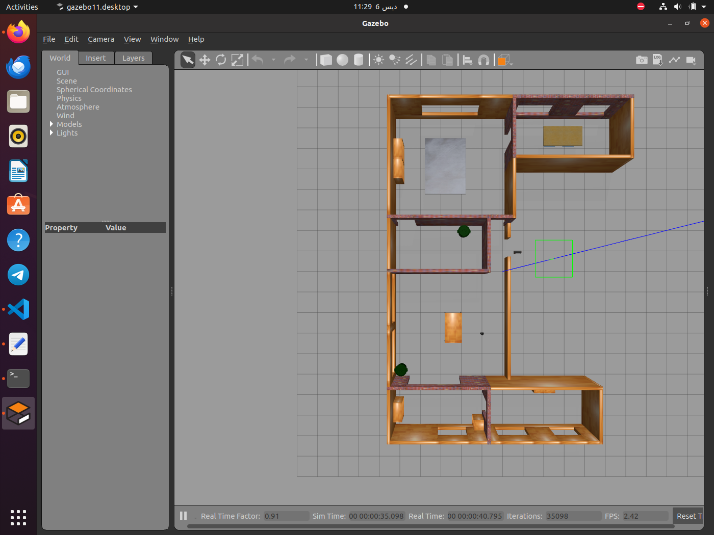
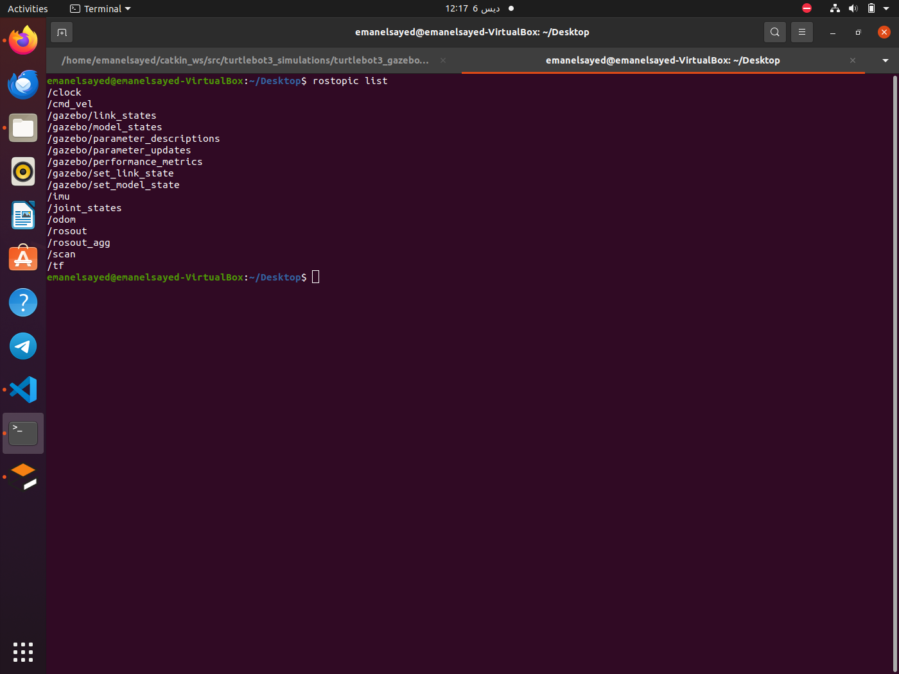

# ROSProject
***These are the main steps to build mapping and navigation robot.***

## Simulatounsly
### 1. Sensors for distence measurements (rplidar - odomerty - camera ) provided by gazebo which create environment also
```
roslaunch turtlebot3_gazebo turtlebot3_house.launch
``` 
#### output 


### topics
 
 
***important topic *** : 
- /scan : readings of rplidarNode [check this] (http://wiki.ros.org/rplidar)

- /tf : to specify frams 
- /odom : reading of odomerty [description](http://docs.ros.org/en/noetic/api/nav_msgs/html/msg/Odometry.html)
- /imu : readings of imu [description](http://docs.ros.org/en/noetic/api/sensor_msgs/html/msg/Imu.html)
### 2. Build map using (Gmapping)
```
roslaunch turtlebot3_slam turtlebot3_slam.launch slam_methods:=gmapping 
```
### topics 


### important topic 
- /map : gmapping published it 
### rqt_graph while drawing map 


### video of drawing map 

https://github.com/EmanElsayed149/ROSProject/assets/91433516/d49bf3b8-5a7a-4b34-aa15-4b1ba302ed8d


### 3. save map 
```
rosrun map_server map_saver -f <path to save your map>
```
### output 


